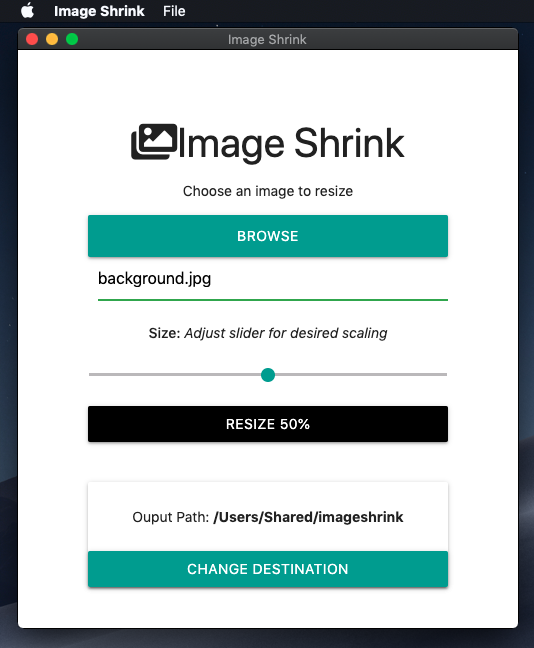

#  Image Shrink

An image-resizing app for scaling-down JPEGs and PNGs.
Built with [Node](https://nodejs.org/) and [Electron](https://www.electronjs.org/).



## Install Node Dependencies
Run npm install from the project root:
```
~image-shrink $ npm install
```

## Packaging
Run the appropriate platform-specific packaging script to build the desktop application. It will show up in a new folder in the project root directory; for instance, on Mac a folder called /Image Shrink-darwin-x64/ will be created.

Mac:
```
~image-shrink $ npm run package-mac
```

Windows:
```
C:\image-shrink> npm run package-win
```

Linux:
```
~image-shrink $ npm run package-linux
```
